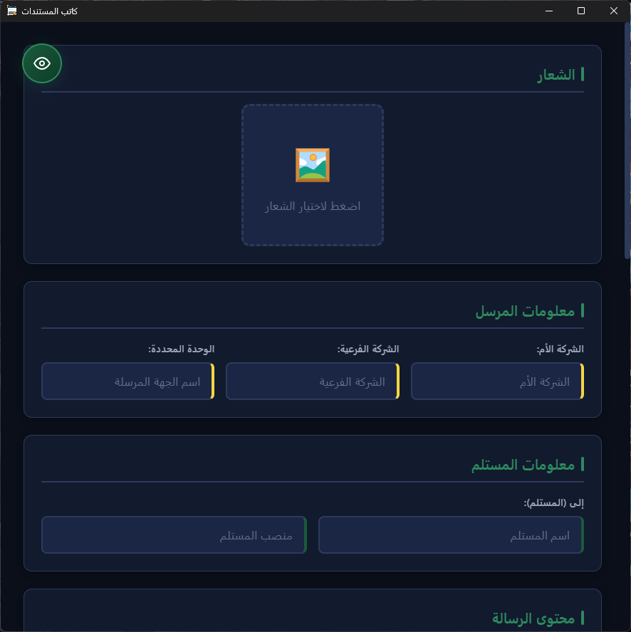
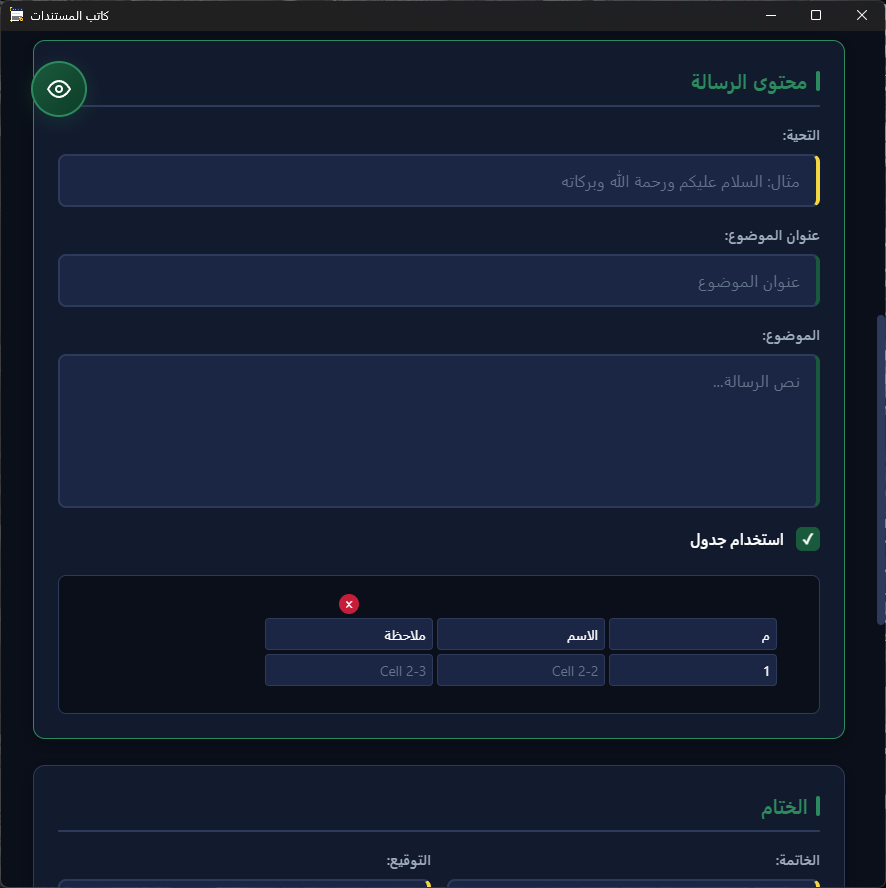
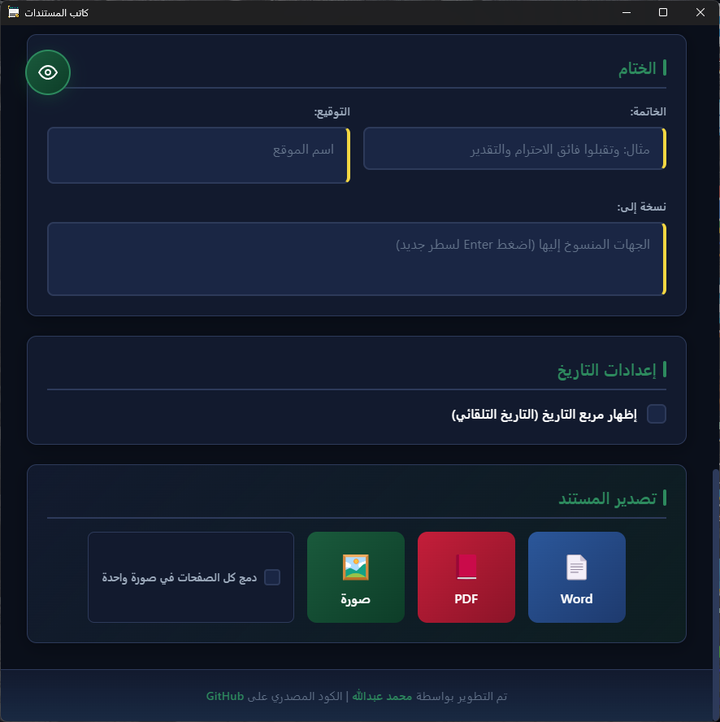
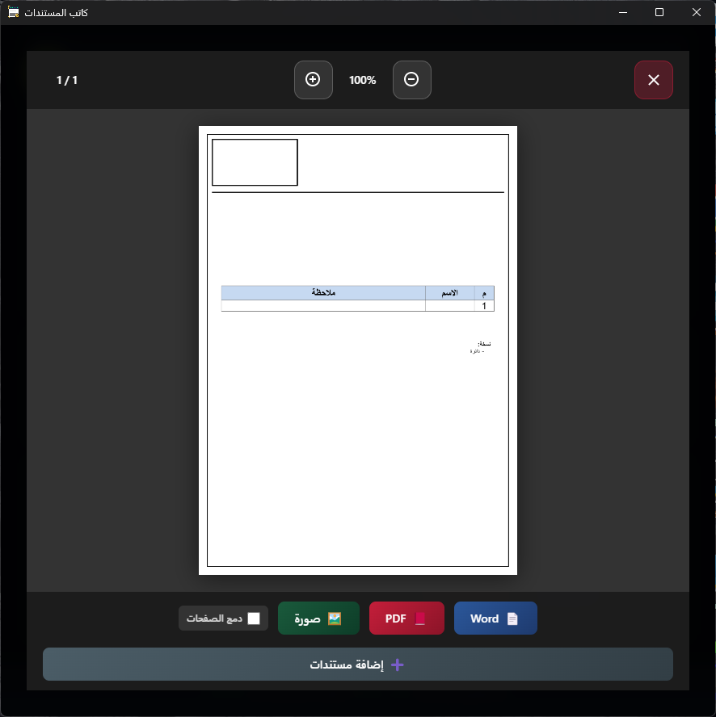

<div align="center">

# 📄 كاتب المستندات - AutoWriter


### تطبيق احترافي لإنشاء وتصدير المستندات الرسمية

[](https://reactjs.org/)
[](https://www.electronjs.org/)
[](https://capacitorjs.com/)
[](LICENSE)

[🖥️ تطوير على الكمبيوتر](#التطوير-على-الكمبيوتر) • [📱 تطوير على الأندرويد](#التطوير-على-الأندرويد) • [📖 دليل الاستخدام](#%EF%B8%8F-واجهة-التطبيق---شرح-تفصيلي)

</div>

---

## 📋 نظرة عامة

**كاتب المستندات** هو تطبيق متعدد المنصات يساعدك على إنشاء المستندات والخطابات الرسمية بسرعة وسهولة. يعمل على أنظمة Windows و Android ويدعم تصدير المستندات بصيغ متعددة (Word، PDF، صورة).

### ✨ المميزات الرئيسية
<div dir="rtl" align="center">

| الميزة | الوصف |
|--------|--------|
| 🎨 **واجهة عربية بالكامل** | تصميم حديث يدعم الاتجاه من اليمين لليسار |
| 📝 **قالب جاهز** | نموذج محدد مسبقاً للخطابات الرسمية |
| 📊 **دعم الجداول** | إنشاء جداول ديناميكية قابلة للتعديل |
| 💾 **حفظ تلقائي** | حفظ البيانات المتكررة (الشعار، معلومات المرسل) |
| 📤 **تصدير متعدد** | Word، PDF، صورة PNG |
| 🔄 **دمج الصفحات** | خيار دمج جميع الصفحات في ملف واحد (للصور) |
| 📱 **دعم الكاميرا** | التقاط صور مباشرة على Android |
| 📂 **فتح الملفات** | دعم Word، PDF، PowerPoint والصور |
</div>

---

## 📸 لقطات الشاشة

<div align="center">

### الواجهة الرئيسية

| قسم الشعار ومعلومات المرسل | قسم المحتوى والجدول | قسم التصدير |
|:-------------------------:|:-------------------:|:-----------:|
|  |  |  |

</div>


---

## 🖥️ واجهة التطبيق - شرح تفصيلي

### 1️⃣ قسم الشعار
<div dir="rtl" align="center">

| العنصر | الوظيفة |
|--------|--------|
| 🖼️ **منطقة الشعار** | اضغط على المربع لاختيار شعار المؤسسة (PNG، JPG، WebP). يدعم الشفافية في صور PNG. |
| ✕ **زر إزالة الشعار** | يظهر بعد اختيار شعار، اضغط عليه لإزالة الشعار الحالي. |
</div>

### 2️⃣ قسم معلومات المرسل
<div dir="rtl" align="center">

| الحقل | الوصف |
|-------|-------|
| 🏢 **الشركة الأم** | اسم الشركة أو المؤسسة الرئيسية (يُحفظ تلقائياً) |
| 🏬 **الشركة الفرعية** | اسم الفرع أو القسم التابع (يُحفظ تلقائياً) |
| 📍 **الوحدة المحددة** | اسم الجهة المرسلة أو الإدارة (يُحفظ تلقائياً) |
</div>

### 3️⃣ قسم معلومات المستلم
<div dir="rtl" align="center">

| الحقل | الوصف |
|-------|-------|
| 👤 **إلى (المستلم)** | اسم المستلم. القيمة الافتراضية: "الأخ / " |
| 💼 **المنصب** | منصب أو لقب المستلم. القيمة الافتراضية: "المحترم" |
</div>

### 4️⃣ قسم محتوى الرسالة
<div dir="rtl" align="center">

| الحقل | الوصف |
|-------|-------|
| 🙏 **التحية** | تحية افتتاحية مثل "السلام عليكم ورحمة الله وبركاته" (يُحفظ تلقائياً) |
| 📌 **عنوان الموضوع** | عنوان الرسالة. القيمة الافتراضية: "الموضوع / " |
| 📝 **الموضوع** | نص الرسالة الرئيسي. يتوسع تلقائياً حسب المحتوى. |
| ☑️ **استخدام جدول** | تفعيل محرر الجدول الديناميكي |
</div>

#### 📊 محرر الجدول

عند تفعيل "استخدام جدول"، يظهر محرر جدول تفاعلي:
<div dir="rtl" align="center">

| الزر | الوظيفة |
|------|---------|
| **زر + بين الاعمدة** | إضافة عمود جديد |
| **زر + بين الصفوف** | إضافة صف جديد |
| **علامة X اعلى العمود** | حذف العمود |
| **علامة X يمين الصف** | حذف الصف |
</div>

### 5️⃣ قسم الختام
<div dir="rtl" align="center">

| الحقل | الوصف |
|-------|-------|
| 👋 **الخاتمة** | عبارة ختامية مثل "وتقبلوا فائق الاحترام والتقدير" (يُحفظ تلقائياً) |
| ✍️ **التوقيع** | اسم الموقع ومنصبه (يُحفظ تلقائياً). يدعم أسطر متعددة. |
| 📋 **نسخة إلى** | الجهات المنسوخ إليها الخطاب. اضغط Enter لإضافة جهات متعددة. |
</div>

### 6️⃣ إعدادات التاريخ
<div dir="rtl" align="center">

| الخيار | الوظيفة |
|--------|---------|
| **☑️ إظهار مربع التاريخ** | عند التفعيل، يُضاف مربع تاريخ تلقائي في أعلى المستند |
</div>

### 7️⃣ أزرار التصدير
<div dir="rtl" align="center">

| الزر | الوظيفة |
|------|--------|
| 📄 **Word** | تصدير المستند بصيغة .docx (قابل للتعديل) |
| 📕 **PDF** | تصدير المستند بصيغة PDF (للطباعة والمشاركة) |
| 🖼️ **صورة** | تصدير المستند كصورة PNG (للمشاركة السريعة) |
| ☑️ **دمج الصفحات** | دمج جميع الصفحات في ملف/صورة واحدة |
</div>

### 8️⃣ زر المعاينة العائم 👁️

زر دائري يظهر في الزاوية السفلية يمين الشاشة. اضغط عليه لـ:
- **معاينة المستند** قبل التصدير
- **التكبير والتصغير** باستخدام أزرار +/-
- **التنقل بين الصفحات** عند وجود أكثر من صفحة
- **التصدير المباشر** من نافذة المعاينة

### 9️⃣ نافذة المعاينة
<div align="center">

</div>
<div dir="rtl" align="center">

| العنصر | الوظيفة |
|--------|---------|
| **زر X** | إغلاق نافذة المعاينة |
| **-/+** | تصغير/تكبير المستند |
| **النسبة المئوية** | مستوى التكبير الحالي |
| **رقم الصفحة** | الصفحة الحالية من إجمالي الصفحات |
| **أسهم التنقل** | الانتقال للصفحة السابقة/التالية |
| **➕ إضافة مستندات** | إضافة صور أو ملفات إضافية |
| **🗑️ حذف الصورة** | حذف الصفحة الحالية (للملفات المضافة) |
</div>

---

## 🔧 التطوير والتشغيل

### المتطلبات

- **Node.js** v18 أو أحدث
- **npm** v9 أو أحدث
- **Android Studio** (لبناء تطبيق Android)

### التطوير على الكمبيوتر

```bash
# استنساخ المشروع
git clone https://github.com/moh-d-m4x/AutoWriter.git
cd AutoWriter

# تثبيت المتطلبات
npm install

# تشغيل وضع التطوير
npm run dev

# تشغيل مع Electron
npm run electron:dev

# بناء نسخة الإنتاج
npm run electron:build
```

### التطوير على الأندرويد

```bash
# بناء الواجهة
npm run build

# مزامنة مع Capacitor
npx cap sync android

# فتح في Android Studio
npx cap open android

# أو تشغيل مباشرة
npx cap run android
```

---

## 📁 هيكل المشروع

```
AutoWriter/
├── 📂 src/                    # الكود المصدري (React)
│   ├── App.jsx               # المكون الرئيسي
│   ├── App.css               # أنماط CSS
│   └── utils/                # أدوات مساعدة
├── 📂 electron/               # ملفات Electron للكمبيوتر
│   ├── main.cjs              # العملية الرئيسية
│   ├── preload.cjs           # سكريبت التحميل المسبق
│   ├── word-converter.ps1    # تحويل Word (Windows)
│   ├── icon.png              # أيقونة التطبيق
│   └── icon.ico              # أيقونة Windows
├── 📂 android/                # مشروع Android (Capacitor)
├── 📂 ref/                    # الموارد المطلوبة
│   └── template.docx         # قالب Word الأساسي
├── 📂 docs/                   # لقطات الشاشة للتوثيق
├── 📂 public/                 # ملفات ثابتة
├── 📄 package.json           # تكوين المشروع والاعتماديات
├── 📄 capacitor.config.ts    # إعدادات Capacitor
├── 📄 vite.config.js         # إعدادات Vite
├── 📄 build_release_exe.bat  # بناء Windows EXE
├── 📄 build_release_apk.bat  # بناء Android APK
├── 📄 generate-icons.js      # توليد الأيقونات
└── 📄 README.md              # هذا الملف
```

---

## 🚀 الميزات المتقدمة

### 📂 فتح الملفات الخارجية

يدعم التطبيق فتح الملفات من خارج التطبيق:
<div dir="rtl" align="center">

| نوع الملف | الامتداد | الوظيفة |
|-----------|----------|---------|
| **مستند Word** | .docx, .doc | تحويل لصور ومعاينة |
| **ملف PDF** | .pdf | تحويل لصور ومعاينة |
| **عرض PowerPoint** | .pptx, .ppt | تحويل لصور ومعاينة |
| **صور** | .png, .jpg, .webp | معاينة مباشرة |
</div>

### 📤 مشاركة الملفات

على Android، يمكنك مشاركة الملفات مع التطبيق:
1. افتح أي ملف مدعوم
2. اختر "مشاركة" أو "فتح باستخدام"
3. اختر "كاتب المستندات"
4. سيتم تحويل الملف وعرضه للمعاينة

### 🖱️ السحب والإفلات (الكمبيوتر)

على نسخة الكمبيوتر:
1. اسحب أي ملف مدعوم
2. أفلته في نافذة التطبيق
3. سيتم معالجته تلقائياً

---

## ⚙️ التقنيات المستخدمة
<div dir="rtl" align="center">

| التقنية | الاستخدام |
|---------|----------|
| **React 18** | واجهة المستخدم |
| **Vite 5** | أداة البناء |
| **Electron 28** | تطبيق سطح المكتب |
| **Capacitor 8** | تطبيق الهاتف |
| **jsPDF** | إنشاء ملفات PDF |
| **PizZip** | معالجة ملفات Word |
| **LibreOffice (Android)** | تحويل المستندات |
</div>

---

## 🤝 المساهمة

المساهمات مرحب بها! يرجى:

1. عمل Fork للمشروع
2. إنشاء فرع جديد (`git checkout -b feature/ميزة-جديدة`)
3. عمل Commit للتغييرات (`git commit -m 'إضافة ميزة جديدة'`)
4. رفع الفرع (`git push origin feature/ميزة-جديدة`)
5. فتح Pull Request

---
## 🙏 شكر وتقدير

يستخدم هذا التطبيق المكتبات والمشاريع مفتوحة المصدر التالية:

- **[LibreOffice](https://www.libreoffice.org/)** - لتحويل المستندات على اندرويد
- **[React](https://reactjs.org/)** - مكتبة واجهة المستخدم
- **[Electron](https://www.electronjs.org/)** - لبناء تطبيق سطح المكتب
- **[Capacitor](https://capacitorjs.com/)** - لبناء تطبيق الهاتف
- **[jsPDF](https://github.com/parallax/jsPDF)** - لإنشاء ملفات PDF
- **[PizZip](https://github.com/open-xml-templating/pizzip)** - لمعالجة ملفات وورد

---


## 📝 الرخصة

هذا المشروع مرخص تحت رخصة MIT - انظر ملف [LICENSE](LICENSE) للتفاصيل.

---

<div align="center">


